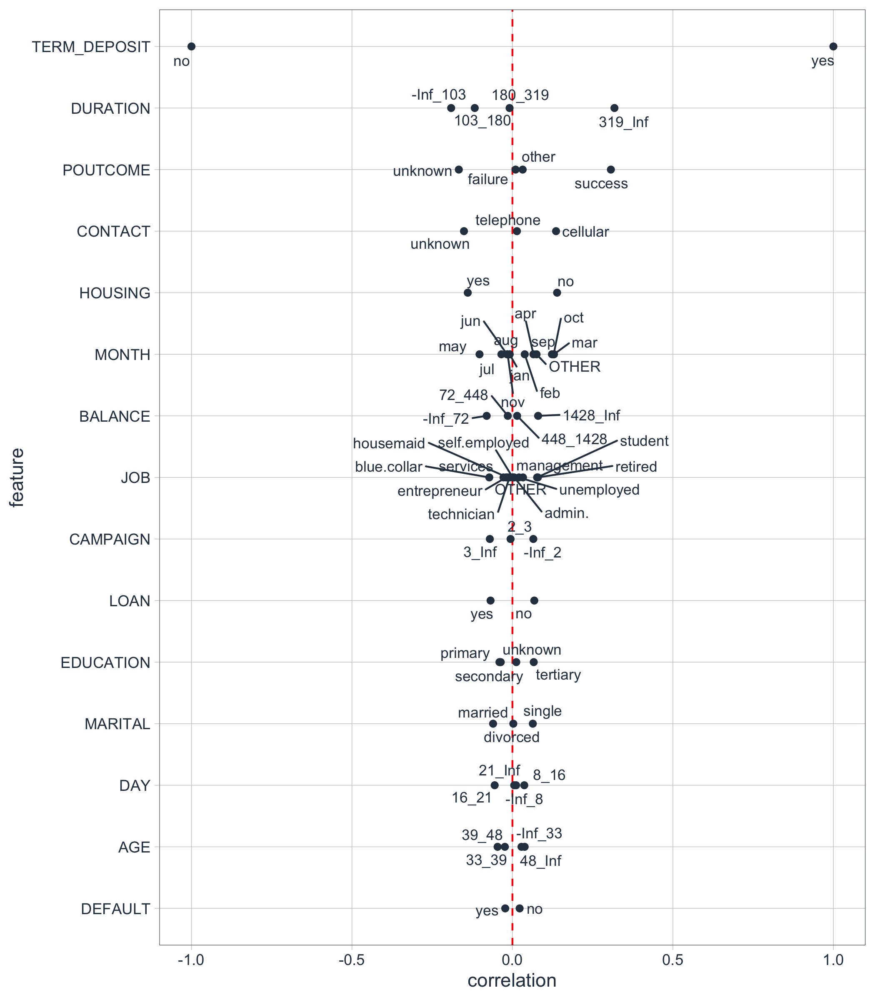
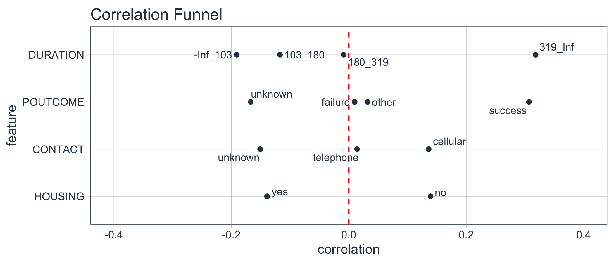
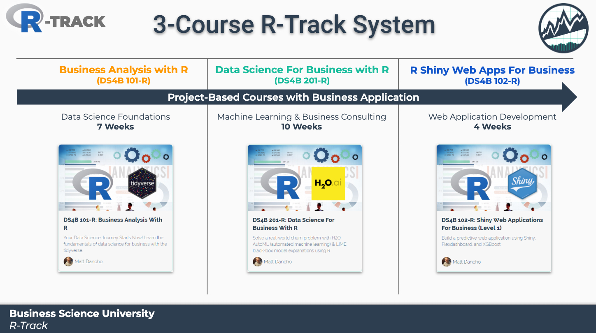

<!-- README.md is generated from README.Rmd. Please edit that file -->

# correlationfunnel 

*by [Business Science](https://www.business-science.io/)*

[](https://www.tidyverse.org/lifecycle/#maturing)
[](https://travis-ci.org/business-science/correlationfunnel)
[](https://codecov.io/github/business-science/correlationfunnel?branch=master)
[](https://cran.r-project.org/package=correlationfunnel)


> Speed Up Exploratory Data Analysis (EDA)

The goal of `correlationfunnel` is to speed up Exploratory Data Analysis
(EDA). Here’s how to use it.

## Installation

You can install the latest stable (CRAN) version of `correlationfunnel`
with:

``` r
install.packages("correlationfunnel")
```

You can install the development version of `correlationfunnel` from
[GitHub](https://github.com/business-science/) with:

``` r
devtools::install_github("business-science/correlationfunnel")
```

## Correlation Funnel in 2-Minutes

**Problem**: Exploratory data analysis (EDA) involves looking at
feature-target relationships independently. This process is very time
consuming even for small data sets. ***Rather than search for
relationships, what if we could let the relationships come to
us?***


**Solution:** Enter `correlationfunnel`. The package provides a
**succinct workflow** and **interactive visualization tools** for
understanding which features have relationships to target (response).

**Main Benefits**:

1.  **Speeds Up Exploratory Data Analysis**

2.  **Improves Feature Selection**

3.  **Gets You To Business Insights Faster**

## Example - Bank Marketing Campaign

The following example showcases the power of **fast exploratory
correlation analysis**. The goal of the analysis is to determine which
features relate to the bank’s marketing campaign goal of having
customers opt into a TERM DEPOSIT (financial product).

We will see that using **3 functions**, we can quickly:

1.  Transform the data into a binary format with `binarize()`

2.  Perform correlation analysis using `correlate()`

3.  Visualize the highest correlation features using
    `plot_correlation_funnel()`

**Result**: Rather than spend hours looking at individual plots of
capaign features and comparing them to which customers opted in to the
TERM DEPOSIT product, in seconds we can discover which groups of
customers have enrolled, drastically speeding up EDA.

### Getting Started

First, load the libraries.

``` r
library(correlationfunnel)
library(dplyr)
```

Next, collect data to analyze. We’ll use Marketing Campaign Data for a
Bank that was popularized by the [UCI Machine Learning
Repository](https://archive.ics.uci.edu/ml/datasets/Bank+Marketing). We
can load the data with
`data("marketing_campaign_tbl")`.

``` r
# Use ?marketing_campagin_tbl to get a description of the marketing campaign features
data("marketing_campaign_tbl")

marketing_campaign_tbl %>% glimpse()
#> Observations: 45,211
#> Variables: 18
#> $ ID           <chr> "2836", "2837", "2838", "2839", "2840", "2841", "28…
#> $ AGE          <dbl> 58, 44, 33, 47, 33, 35, 28, 42, 58, 43, 41, 29, 53,…
#> $ JOB          <chr> "management", "technician", "entrepreneur", "blue-c…
#> $ MARITAL      <chr> "married", "single", "married", "married", "single"…
#> $ EDUCATION    <chr> "tertiary", "secondary", "secondary", "unknown", "u…
#> $ DEFAULT      <chr> "no", "no", "no", "no", "no", "no", "no", "yes", "n…
#> $ BALANCE      <dbl> 2143, 29, 2, 1506, 1, 231, 447, 2, 121, 593, 270, 3…
#> $ HOUSING      <chr> "yes", "yes", "yes", "yes", "no", "yes", "yes", "ye…
#> $ LOAN         <chr> "no", "no", "yes", "no", "no", "no", "yes", "no", "…
#> $ CONTACT      <chr> "unknown", "unknown", "unknown", "unknown", "unknow…
#> $ DAY          <dbl> 5, 5, 5, 5, 5, 5, 5, 5, 5, 5, 5, 5, 5, 5, 5, 5, 5, …
#> $ MONTH        <chr> "may", "may", "may", "may", "may", "may", "may", "m…
#> $ DURATION     <dbl> 261, 151, 76, 92, 198, 139, 217, 380, 50, 55, 222, …
#> $ CAMPAIGN     <dbl> 1, 1, 1, 1, 1, 1, 1, 1, 1, 1, 1, 1, 1, 1, 1, 1, 1, …
#> $ PDAYS        <dbl> -1, -1, -1, -1, -1, -1, -1, -1, -1, -1, -1, -1, -1,…
#> $ PREVIOUS     <dbl> 0, 0, 0, 0, 0, 0, 0, 0, 0, 0, 0, 0, 0, 0, 0, 0, 0, …
#> $ POUTCOME     <chr> "unknown", "unknown", "unknown", "unknown", "unknow…
#> $ TERM_DEPOSIT <chr> "no", "no", "no", "no", "no", "no", "no", "no", "no…
```

### Response & Predictor Relationships

Modeling and Machine Learning problems often involve a response
(Enrolled in `TERM_DEPOSIT`, yes/no) and many predictors (AGE, JOB,
MARITAL, etc). Our job is to determine which predictors are related to
the response. We can do this through **Binary Correlation Analysis**.

### Binary Correlation Analysis

Binary Correlation Analysis is the process of converting continuous
(numeric) and categorical (character/factor) data to binary features. We
can then perform a correlation analysis to see if there is predictive
value between the features and the response (target).

#### Step 1: Convert to Binary Format

The first step is converting the continuous and categorical data into
binary (0/1) format. We de-select any non-predictive features. The
`binarize()` function then converts the features into binary features.

  - **Numeric Features:** Are binned into ranges or if few unique levels
    are binned by their value, and then converted to binary features via
    one-hot encoding

  - **Categorical Features**: Are binned by one-hot encoding

The result is a data frame that has only binary data with columns
representing the bins that the observations fall into. Note that the
output is shown in the `glimpse()` format. THere are now 80 columns that
are binary (0/1).

``` r
marketing_campaign_binarized_tbl <- marketing_campaign_tbl %>%
    select(-ID) %>%
    binarize(n_bins = 4, thresh_infreq = 0.01)

marketing_campaign_binarized_tbl %>% glimpse()
#> Observations: 45,211
#> Variables: 74
#> $ `AGE__-Inf_33`       <dbl> 0, 0, 1, 0, 1, 0, 1, 0, 0, 0, 0, 1, 0, 0, 0…
#> $ AGE__33_39           <dbl> 0, 0, 0, 0, 0, 1, 0, 0, 0, 0, 0, 0, 0, 0, 0…
#> $ AGE__39_48           <dbl> 0, 1, 0, 1, 0, 0, 0, 1, 0, 1, 1, 0, 0, 0, 0…
#> $ AGE__48_Inf          <dbl> 1, 0, 0, 0, 0, 0, 0, 0, 1, 0, 0, 0, 1, 1, 1…
#> $ JOB__admin.          <dbl> 0, 0, 0, 0, 0, 0, 0, 0, 0, 0, 1, 1, 0, 0, 0…
#> $ `JOB__blue-collar`   <dbl> 0, 0, 0, 1, 0, 0, 0, 0, 0, 0, 0, 0, 0, 0, 0…
#> $ JOB__entrepreneur    <dbl> 0, 0, 1, 0, 0, 0, 0, 1, 0, 0, 0, 0, 0, 0, 0…
#> $ JOB__housemaid       <dbl> 0, 0, 0, 0, 0, 0, 0, 0, 0, 0, 0, 0, 0, 0, 0…
#> $ JOB__management      <dbl> 1, 0, 0, 0, 0, 1, 1, 0, 0, 0, 0, 0, 0, 0, 0…
#> $ JOB__retired         <dbl> 0, 0, 0, 0, 0, 0, 0, 0, 1, 0, 0, 0, 0, 0, 0…
#> $ `JOB__self-employed` <dbl> 0, 0, 0, 0, 0, 0, 0, 0, 0, 0, 0, 0, 0, 0, 0…
#> $ JOB__services        <dbl> 0, 0, 0, 0, 0, 0, 0, 0, 0, 0, 0, 0, 0, 0, 1…
#> $ JOB__student         <dbl> 0, 0, 0, 0, 0, 0, 0, 0, 0, 0, 0, 0, 0, 0, 0…
#> $ JOB__technician      <dbl> 0, 1, 0, 0, 0, 0, 0, 0, 0, 1, 0, 0, 1, 1, 0…
#> $ JOB__unemployed      <dbl> 0, 0, 0, 0, 0, 0, 0, 0, 0, 0, 0, 0, 0, 0, 0…
#> $ `JOB__-OTHER`        <dbl> 0, 0, 0, 0, 1, 0, 0, 0, 0, 0, 0, 0, 0, 0, 0…
#> $ MARITAL__divorced    <dbl> 0, 0, 0, 0, 0, 0, 0, 1, 0, 0, 1, 0, 0, 0, 0…
#> $ MARITAL__married     <dbl> 1, 0, 1, 1, 0, 1, 0, 0, 1, 0, 0, 0, 1, 1, 1…
#> $ MARITAL__single      <dbl> 0, 1, 0, 0, 1, 0, 1, 0, 0, 1, 0, 1, 0, 0, 0…
#> $ EDUCATION__primary   <dbl> 0, 0, 0, 0, 0, 0, 0, 0, 1, 0, 0, 0, 0, 0, 0…
#> $ EDUCATION__secondary <dbl> 0, 1, 1, 0, 0, 0, 0, 0, 0, 1, 1, 1, 1, 0, 1…
#> $ EDUCATION__tertiary  <dbl> 1, 0, 0, 0, 0, 1, 1, 1, 0, 0, 0, 0, 0, 0, 0…
#> $ EDUCATION__unknown   <dbl> 0, 0, 0, 1, 1, 0, 0, 0, 0, 0, 0, 0, 0, 1, 0…
#> $ DEFAULT__no          <dbl> 1, 1, 1, 1, 1, 1, 1, 0, 1, 1, 1, 1, 1, 1, 1…
#> $ DEFAULT__yes         <dbl> 0, 0, 0, 0, 0, 0, 0, 1, 0, 0, 0, 0, 0, 0, 0…
#> $ `BALANCE__-Inf_72`   <dbl> 0, 1, 1, 0, 1, 0, 0, 1, 0, 0, 0, 0, 1, 1, 0…
#> $ BALANCE__72_448      <dbl> 0, 0, 0, 0, 0, 1, 1, 0, 1, 0, 1, 1, 0, 0, 1…
#> $ BALANCE__448_1428    <dbl> 0, 0, 0, 0, 0, 0, 0, 0, 0, 1, 0, 0, 0, 0, 0…
#> $ BALANCE__1428_Inf    <dbl> 1, 0, 0, 1, 0, 0, 0, 0, 0, 0, 0, 0, 0, 0, 0…
#> $ HOUSING__no          <dbl> 0, 0, 0, 0, 1, 0, 0, 0, 0, 0, 0, 0, 0, 0, 0…
#> $ HOUSING__yes         <dbl> 1, 1, 1, 1, 0, 1, 1, 1, 1, 1, 1, 1, 1, 1, 1…
#> $ LOAN__no             <dbl> 1, 1, 0, 1, 1, 1, 0, 1, 1, 1, 1, 1, 1, 1, 1…
#> $ LOAN__yes            <dbl> 0, 0, 1, 0, 0, 0, 1, 0, 0, 0, 0, 0, 0, 0, 0…
#> $ CONTACT__cellular    <dbl> 0, 0, 0, 0, 0, 0, 0, 0, 0, 0, 0, 0, 0, 0, 0…
#> $ CONTACT__telephone   <dbl> 0, 0, 0, 0, 0, 0, 0, 0, 0, 0, 0, 0, 0, 0, 0…
#> $ CONTACT__unknown     <dbl> 1, 1, 1, 1, 1, 1, 1, 1, 1, 1, 1, 1, 1, 1, 1…
#> $ `DAY__-Inf_8`        <dbl> 1, 1, 1, 1, 1, 1, 1, 1, 1, 1, 1, 1, 1, 1, 1…
#> $ DAY__8_16            <dbl> 0, 0, 0, 0, 0, 0, 0, 0, 0, 0, 0, 0, 0, 0, 0…
#> $ DAY__16_21           <dbl> 0, 0, 0, 0, 0, 0, 0, 0, 0, 0, 0, 0, 0, 0, 0…
#> $ DAY__21_Inf          <dbl> 0, 0, 0, 0, 0, 0, 0, 0, 0, 0, 0, 0, 0, 0, 0…
#> $ MONTH__apr           <dbl> 0, 0, 0, 0, 0, 0, 0, 0, 0, 0, 0, 0, 0, 0, 0…
#> $ MONTH__aug           <dbl> 0, 0, 0, 0, 0, 0, 0, 0, 0, 0, 0, 0, 0, 0, 0…
#> $ MONTH__feb           <dbl> 0, 0, 0, 0, 0, 0, 0, 0, 0, 0, 0, 0, 0, 0, 0…
#> $ MONTH__jan           <dbl> 0, 0, 0, 0, 0, 0, 0, 0, 0, 0, 0, 0, 0, 0, 0…
#> $ MONTH__jul           <dbl> 0, 0, 0, 0, 0, 0, 0, 0, 0, 0, 0, 0, 0, 0, 0…
#> $ MONTH__jun           <dbl> 0, 0, 0, 0, 0, 0, 0, 0, 0, 0, 0, 0, 0, 0, 0…
#> $ MONTH__mar           <dbl> 0, 0, 0, 0, 0, 0, 0, 0, 0, 0, 0, 0, 0, 0, 0…
#> $ MONTH__may           <dbl> 1, 1, 1, 1, 1, 1, 1, 1, 1, 1, 1, 1, 1, 1, 1…
#> $ MONTH__nov           <dbl> 0, 0, 0, 0, 0, 0, 0, 0, 0, 0, 0, 0, 0, 0, 0…
#> $ MONTH__oct           <dbl> 0, 0, 0, 0, 0, 0, 0, 0, 0, 0, 0, 0, 0, 0, 0…
#> $ MONTH__sep           <dbl> 0, 0, 0, 0, 0, 0, 0, 0, 0, 0, 0, 0, 0, 0, 0…
#> $ `MONTH__-OTHER`      <dbl> 0, 0, 0, 0, 0, 0, 0, 0, 0, 0, 0, 0, 0, 0, 0…
#> $ `DURATION__-Inf_103` <dbl> 0, 0, 1, 1, 0, 0, 0, 0, 1, 1, 0, 0, 0, 1, 0…
#> $ DURATION__103_180    <dbl> 0, 1, 0, 0, 0, 1, 0, 0, 0, 0, 0, 1, 0, 0, 1…
#> $ DURATION__180_319    <dbl> 1, 0, 0, 0, 1, 0, 1, 0, 0, 0, 1, 0, 0, 0, 0…
#> $ DURATION__319_Inf    <dbl> 0, 0, 0, 0, 0, 0, 0, 1, 0, 0, 0, 0, 1, 0, 0…
#> $ `CAMPAIGN__-Inf_2`   <dbl> 1, 1, 1, 1, 1, 1, 1, 1, 1, 1, 1, 1, 1, 1, 1…
#> $ CAMPAIGN__2_3        <dbl> 0, 0, 0, 0, 0, 0, 0, 0, 0, 0, 0, 0, 0, 0, 0…
#> $ CAMPAIGN__3_Inf      <dbl> 0, 0, 0, 0, 0, 0, 0, 0, 0, 0, 0, 0, 0, 0, 0…
#> $ `PDAYS__-1`          <dbl> 1, 1, 1, 1, 1, 1, 1, 1, 1, 1, 1, 1, 1, 1, 1…
#> $ `PDAYS__-OTHER`      <dbl> 0, 0, 0, 0, 0, 0, 0, 0, 0, 0, 0, 0, 0, 0, 0…
#> $ PREVIOUS__0          <dbl> 1, 1, 1, 1, 1, 1, 1, 1, 1, 1, 1, 1, 1, 1, 1…
#> $ PREVIOUS__1          <dbl> 0, 0, 0, 0, 0, 0, 0, 0, 0, 0, 0, 0, 0, 0, 0…
#> $ PREVIOUS__2          <dbl> 0, 0, 0, 0, 0, 0, 0, 0, 0, 0, 0, 0, 0, 0, 0…
#> $ PREVIOUS__3          <dbl> 0, 0, 0, 0, 0, 0, 0, 0, 0, 0, 0, 0, 0, 0, 0…
#> $ PREVIOUS__4          <dbl> 0, 0, 0, 0, 0, 0, 0, 0, 0, 0, 0, 0, 0, 0, 0…
#> $ PREVIOUS__5          <dbl> 0, 0, 0, 0, 0, 0, 0, 0, 0, 0, 0, 0, 0, 0, 0…
#> $ `PREVIOUS__-OTHER`   <dbl> 0, 0, 0, 0, 0, 0, 0, 0, 0, 0, 0, 0, 0, 0, 0…
#> $ POUTCOME__failure    <dbl> 0, 0, 0, 0, 0, 0, 0, 0, 0, 0, 0, 0, 0, 0, 0…
#> $ POUTCOME__other      <dbl> 0, 0, 0, 0, 0, 0, 0, 0, 0, 0, 0, 0, 0, 0, 0…
#> $ POUTCOME__success    <dbl> 0, 0, 0, 0, 0, 0, 0, 0, 0, 0, 0, 0, 0, 0, 0…
#> $ POUTCOME__unknown    <dbl> 1, 1, 1, 1, 1, 1, 1, 1, 1, 1, 1, 1, 1, 1, 1…
#> $ TERM_DEPOSIT__no     <dbl> 1, 1, 1, 1, 1, 1, 1, 1, 1, 1, 1, 1, 1, 1, 1…
#> $ TERM_DEPOSIT__yes    <dbl> 0, 0, 0, 0, 0, 0, 0, 0, 0, 0, 0, 0, 0, 0, 0…
```

#### Step 2: Perform Correlation Analysis

The second step is to perform a correlation analysis between the
response (target = TERM\_DEPOSIT\_yes) and the rest of the features.
This returns a specially formatted tibble with the feature, the bin, and
the bin’s correlation to the target. The format is exactly what we need
for the next step - Producing the **Correlation
Funnel**

``` r
marketing_campaign_correlated_tbl <- marketing_campaign_binarized_tbl %>%
    correlate(target = TERM_DEPOSIT__yes)

marketing_campaign_correlated_tbl
#> # A tibble: 74 x 3
#>    feature      bin      correlation
#>    <fct>        <chr>          <dbl>
#>  1 TERM_DEPOSIT no            -1.000
#>  2 TERM_DEPOSIT yes            1.000
#>  3 DURATION     319_Inf        0.318
#>  4 POUTCOME     success        0.307
#>  5 DURATION     -Inf_103      -0.191
#>  6 PDAYS        -OTHER         0.167
#>  7 PDAYS        -1            -0.167
#>  8 PREVIOUS     0             -0.167
#>  9 POUTCOME     unknown       -0.167
#> 10 CONTACT      unknown       -0.151
#> # … with 64 more rows
```

#### Step 3: Visualize the Correlation Funnel

A **Correlation Funnel** is an tornado plot that lists the highest
correlation features (based on absolute magnitude) at the top of the and
the lowest correlation features at the bottom. The resulting
visualization looks like a Funnel.

To produce the **Correlation Funnel**, use `plot_correlation_funnel()`.
Try setting `interactive = TRUE` to get an interactive plot that can be
zoomed in on.

``` r
marketing_campaign_correlated_tbl %>%
    plot_correlation_funnel(interactive = FALSE)
```



### Examining the Results

The most important features are towards the top. We can investigate
these.

``` r
marketing_campaign_correlated_tbl %>%
    filter(feature %in% c("DURATION", "POUTCOME", "PDAYS", 
                          "PREVIOUS", "CONTACT", "HOUSING")) %>%
    plot_correlation_funnel(interactive = FALSE, limits = c(-0.4, 0.4))
```



We can see that the following prospect groups have a much greater
correlation with enrollment in the TERM DEPOSIT product:

  - When the DURATION, the amount of time a prospect is engaged in
    marketing campaign material, is 319 seconds or longer.

  - When POUTCOME, whether or not a prospect has previously enrolled in
    a product, is “success”.

  - When CONTACT, the medium used to contact the person, is “cellular”

  - When HOUSING, whether or not the contact has a HOME LOAN is “no”

## Other Great EDA Packages in R

The main addition of `correlationfunnel` is to quickly expose feature
relationships to semi-processed data meaning missing (`NA`) values have
been treated, date or date-time features have been feature engineered,
and data is in a “clean” format (numeric data and categorical data are
ready to be correlated to a Yes/No response).

Here are several great EDA packages that can help you understand data
issues (cleanliness) and get data preprared for Correlation Analysis\!

  - [Data Explorer](https://boxuancui.github.io/DataExplorer/) -
    Automates Exploration and Data Treatment. Amazing for investigating
    features quickly and efficiently including by data type, missing
    data, feature engineering, and identifying relationships.

  - [naniar](http://naniar.njtierney.com/) - For understanding missing
    data.

  - [UpSetR](https://github.com/hms-dbmi/UpSetR) - For generating upset
    plots

  - [GGally](https://ggobi.github.io/ggally/) - The `ggpairs()` function
    is one of my all-time favorites for visualizing many features
    quickly.

## Using Correlation Funnel? You Might Be Interested in Applied Business Education

[***Business Science***](https://www.business-science.io/) teaches
students how to apply data science for business. The entire curriculum
is crafted around business consulting with data science. *Correlation
Analysis* is one of the many techniques that we teach in our curriculum.
**Learn from our data science application experience with real-world
business projects.**

### Learn from Real-World Business Projects

Students learn by solving real world projects using our repeatable
project-management framework along with cutting-edge tools like the
Correlation Analysis, Automated Machine Learning, and Feature
Explanation as part of our ROI-Driven Data Science
Curriculum.

<a href="https://university.business-science.io/p/machine-learning-web-apps-level-1-bundle-r-track-courses-101-102-201"></a>

  - [**Learn Data Science Foundations
    (DS4B 101-R)**](https://university.business-science.io/p/ds4b-101-r-business-analysis-r):
    Learn the entire `tidyverse` (`dplyr`, `ggplot2`, `rmarkdown`, &
    more) and `parsnip` - Solve 2 Projects - Customer Segmentation and
    Price Optimization projects

  - [**Learn Advanced Machine Learning & Business Consulting
    (DS4B 201-R)**](https://university.business-science.io/p/hr201-using-machine-learning-h2o-lime-to-predict-employee-turnover/):
    Churn Project solved with Correlation Analysis, `H2O` AutoML, `LIME`
    Feature Explanation, and ROI-driven Analysis / Recommendation
    Systems

  - [**Learn Predictive Web Application Development
    (DS4B 102-R)**](https://university.business-science.io/p/ds4b-102-r-shiny-web-application-business-level-1/):
    Build 2 Predictive `Shiny` Web Apps - Sales Dashboard with Demand
    Forecasting & Price Prediction App
